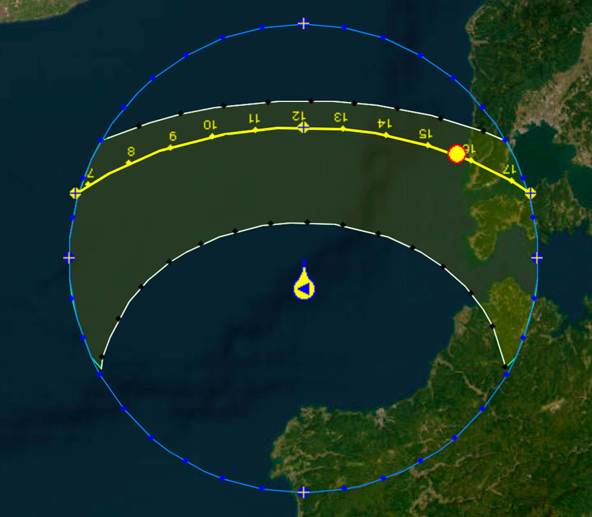

# One Piece IRL Location
Based on video ["ONE PIECE" Worldwide Sales Exceed 600 Million Copies - "What is ONE PIECE?"](https://www.youtube.com/watch?v=O9M1UMj-vwE) (orig.:『ONE PIECE』全世界累計発行部数6億部突破記念企画「ONE PIECEとは？」)

## Content
- Gathered Info
  - [Timestamps](#timestamps)
  - [Map](#map)
  - [Ship](#ship)
- [Deduction process](#deduction-process)
- [Reasoning](#reasoning)
- [Conclusion](#conclusion)
- [Tools](#tools)

# Gathered Info
## Timestamps
- @[1:13](https://youtu.be/O9M1UMj-vwE?t=73) - Feb. XX - 3:40 PM \[Local Time] Arrival at specified drop point
- @[1:19](https://youtu.be/O9M1UMj-vwE?t=79) - 4:32 PM Deep-sea descent begins
- @[1:29](https://youtu.be/O9M1UMj-vwE?t=89) - 4:51 PM 200m and descending
- @[1:32](https://youtu.be/O9M1UMj-vwE?t=92) - 5:04 PM Sea floor touchdown at 651m

## Map
<table>
<tr>
    <td>
        
    </td>
    <td>
        
    </td>
</tr>
</table>

## Ship
<table>
<tr>
    <td>
        
    </td>
    <td>
        
    </td>
</tr>
<tr>
    <td>
        
    </td>
    <td>
        
    </td>
</tr>
<tr>
    <td>
        
    </td>
</tr>
</table>

# Deduction process
### 1. Put the two maps from video together:

### 2. Redraw in vector to capture details

### 3. Look for parts of Japan coast that fit these parameters:
  - Shape of the coastline  
  - Near ship harbor presence  
  - Sea floor depth profile (has to be >600m deep)  
  - No mountains or significant landscape in view when taking into account the possition of the Sun on the ship footage  

### 5. Most possible match: Noto Peninsula, Toyama Bay

# Reasoning
- The shape and depth on the map shown in video checks out with depth profile of that part of Toyama bay.
- The position of the Sun at the time of the drop suggests that frames featuring the ship are looking towards the city of Nanao.
  - 
- Shores of Noto peninsula should be visible from the drop point, as it is only ~12 km away (and since there are some hills up to 300 m above sea level, on clear day visible from as far as 60 km). But since the drop happened in mid/late february, I believe we have to take into account the atmospheric haze happening during transition from winter to spring (air temperature rises while the water remains near 10-12℃, this temperature inversion creates a layer of moisture near the surface, obscuring shores, even at a relatively close ~12 km range).
- Since the payload was released at 16:32 and touched the seafloor (651 m) at 17:04, that gives us 32 minutes = 1,920 seconds, with average Velocity (v): ≈0.34 m/s. Given the water density in February in the Sea of Japan is increased (≈1027 kg/m³)
  - With the Depth, Water Density (ρ) in this part of the year and Total Descent Time noted, Terminal Velocity (Vt) of the object is:
    - Vt = 651 / 1920 = **0.34 m/s**
  - This can help with estimation of the weight of the probe in water, if we take note of the Drag Coefficient (1) and Surface Area (~0.40 m²):
    - Wnet​ = 0.5 ​× ρ × Cd × A × Vt²
    - Wnet = 0.5 ​× 651 ​× 1 ​× 0.4 ​× 0.34² = 15 Kg
  - **Pure speculation**: Weight on the air could be somewhere around ~80 kg for whole probe, ~15 Kg for only the One Piece part.

# Conclusion
I believe One Piece is somewhere around 37°09'32.44"N 137°10'18.85"E

---

# Tools
- [OpenSeaMap](https://map.openseamap.org/)
- [SunEarthTools.com](https://www.sunearthtools.com/dp/tools/pos_sun.php)
- Google Earth
- Google Gemini for some calculations
